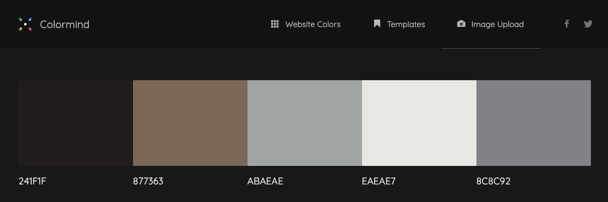

# Real Movie-Review-Database (MS3) #

## Blockbusters, McGuffins & Moes 

[BMMDB Live Site](https://bmmdb.herokuapp.com)

[BMMDB - Github - Site](https://github.com/cofoeducistudent/BMMDB_c)

>With the many film review sites on the internet, I found it frustrating that the reviews frequently had an agenda. Indeed,I have found that I could not trust them. There are reasons for this. Primarily it’s that most reviews come from one source or publisher, and the others from the general public, who mainly are not professional film reviewers, rather individuals voicing an opinion. However, in both situations a bias agenda exits, nonetheless. I wanted to balance this out somewhat. Therefore, I decided to take the best from both sides of reviewer types and see what I could come up with.I decided to make a film review website, that can be controlled to eliminate the bias as much as possible. Therefore, I set the following brief to attain a site suited to something I would like to see.

>## Project Brief ##

* My scenario was to create a MOVIE REVIEW WEBSITE to promote movies past and present, in a professionally critiqued manner. The sites 'ssp' will be the sourcing of reviews from curated public film reviewers. I don't wish to have clickbait/slanderous soundbite reviews, in respect to our reviews, but calm considered critique. In effect I wish to distance the site from the predominant types of reviewers on the web.The first, a homogenous company having the hidden agenda of reviews favouring particular movie production companies via a nepotist back channel.
The other is the many millennial ‘woke’ childish reviews targeting films that do not conform to their partisan view of what a film should be, simply for slander for gaining self promotion.

* I want a clean looking site, with calm considered reviews, that present reviews within the 'class' a film was intended for. The site will aim to have more serious content and attract true film officiators.Comparing a low budget film with a tent pole $200 million dollar production is simply ridiculous.

* To help solve the above issues, each reviewer is be sourced from the public, however, they will not be allowed to post reviews without membership and agreeing to our terms and conditions. Or they will be struck off, with all their reviews removed.

* Secondly the reviewers will cover specific topic areas, thus keeping a strict format. Each section section will have a corresponding one,  for a citation supporting the review

* This will cause the poster to think and validate any assertions made. Rather than writing flippant soundbites!

|No|Review Area|Supporting Citation|
|--|--------------|---------------|
|1|Synopsis|N/A|
|2|Script-review|Citation|
|3|Acting-review|Citation|
|4|Technical-review|Citation|
|5|Sound-review|Citation|
|6|Summary|N/A|

A guiding principle will be that each review should be carried out in comparison to a film of similar genre and production budget, else the reviews will be unfair.

Each review will be supported with:

* A single image of the film (usually the production released public poster).

* review attributes. These include:

* Title, sub-title, genre, stars (0-5).

* Each reviewer will have the autonomy to administrate their reviews by update or delete.However, they cannot interfere with other reviewers reviews of course.

* The public will be able to search for a particular title, or browse through existing reviews

# Index

>1 UX

a. Strategy

b. Scope

c. Structure

d. Skeleton

e. Surface

>2.FEATURES

a. Existing Features

b. Features Left to Implement

>3.TECHNOLOGIES USED

>4.TESTING

>5.DEPLOYMENT

>6.CREDITS

>7.CONTENT

>8.MEDIA

>9.ACKNOWLEDGEMENTS

>10.USEAGE INSTRUCTIONS

# UX

## STRATEGY

The website is to be created and hosted on Heroku. **GitHub cannot be used in this instance as the site requires technologies that make it dynamic. GitHub does not allow non-static sites.**

I intend to use the following technologies:

* HTML, for the structure
* CSS, for styling
* Google Fonts
* Fontawesome - for icons
* Bootstrap, takes up the heavy lifting of form and formatting
* Mongo database (Atlas) – for a database storage solution
* Flask micro-framework - will be used as the template infrastructure. One that uses the Jinja engine
* Python3 – for program control logic
* Git & GitHub will be used for Version control
* Heroku platform – Will be used for hosting

To clarify the objective for the site, its worth reminding ourselves of the user requirements.

> External User Goal** (Mainly the general public)

* Users will be able to search and browse existing reviews
* Registered users – Will be able receive promotional material via email
* Authorized Users (posters) – Will be able to post movie reviews, having full (CRUD) functionality.

> Site Owner Goal

* The site owner will be able to publish a “self-user-moderated site”, presenting reviews for movies past and present.
* The site owner will be able to convert registered users to “authorized reviewers”, allowing them to post movie reviews
* Site owners – Will be able post promo material to registered users and communicate.
* Site owners or designated site Admins will be able to delete entire database, promote users to 'posters'

## SCOPE

There are endless features possible for a site such as this, however we will limit our scope.

**In scope:**

* Database design & connectivity
* Website pages design
* **Although not requested in the MS3 task, a rudimentary authentication process has been implemented to reduce rouge postings and/or abuse of content.** It is not a fully realized login security system and does not employ sessions. Rather, it is a simple authentication against existing database credentials.

In addition there will be :

* Full CRUD ability for ‘authorized-users’..... (Create, Read, Update, Delete)
* Partial CRUD for ‘non-authorized / un-registered users’.....(Read).
* Affiliate Site link ability for authorized 'posters' ( Allows them to lik to a e-commerce site)

**Outside Scope:**

* **Mass deletion or reviews for admin purposes can be added**, and I have  included a field in the reviews data structure for that purpose(m-process). However as I do not think that is critical for this release it has been de-scoped.

**CRUD features for clarity mean:**

* Creation of a movie review (Create).
* Reading of an existing search (Read).
* Modification of an existing review (Update).
* Deletion of an existing review (Delete)

> ## User Stories ##

I have identified 4 main users or stakeholders for this site

1. **Site Owner**
2. **Site Admin**
3. **Registered Users** (Poster)
4. **Anon User**

|Story|User Type|Feature|Reason/Goal|
|-----|---------|-------|-----------|
|1|Site Owner|I want a movie review website|So that I can create a traffic hotspot, that can be used later for marketing purposes|
|2|Site OWner|I want users to be able to post reviews| To reduce the maintenaces and information population burden|
|3|Site Owner|I want some method of rudimentary authentication, incl contact information| So that site has some inherent basic moderation and also I can accquire contact details to reduce SPAM content and ultmately govern uses|
|4|Site Owner|I want a Registration Page|To allow the public to apply for membership|
|5|Site Owner|I want a contact feature| So that the posters and general public an communicate with us|
|6|Site Owner|I want a contribute feature| So that no members can suggest movies for review|
|7|Site Owner|I want a members page| So that member(authorized users) can amend/delete their reviews  giving them full (CRUD) ability for their posts|
|8|Site Owner|I want a method of affiliation sale-thru| So I can incentivize good reviewers, for more quality posts|  
|-||||
|9|Site Admin|I want a 'Database Initialize' ability | I can restore (after initialization & test of new site install ) The site can be cleared within seconds.
|10|Site Admin|I want a user 'PROMOTE-USER' feature|So that I can at will grant a new (Registered) member 'POST' ability on merit"
|11|Site Admin|I want a affiliate-link Activation feature| So that I can target and grant our top reviewers, pass-though-sale ability as a reward for continuous quality postings|
|-||||
|12|Anon User|I wish to see a browse/search feature|So I can read posted reviews about movies|
|-||||
|13|Registered User|I wish for a my movie reviews management page|So that I can (Post/Update/Delete) my reviews|

>## Structure ##
The site will be dynamic, involving a few technologies

* HTML
* CSS
* Flask
* Bootstrap
* Google Fonts
* Font-awesome
* Database (Mongo)

I will implement the site using the following folder/file structure.

| Folder   |  Content  |
|----------|-----------|
| static   | This folder contains Images, CSS|
| templates| HTML files, temp files|
| flask | Contains the project files |
| support | files supporting this README.md document |
| vscode| workfolder|
| venv | Virtual environment|

The site is classed as dynamic, moving data back and forth from a separate database. Only features within the defined scope will be implemented. There will be enough functionality to allow the site to be visibly operative. However the greater infrastructure support such as email - communications to the members and mailshot facility will not be operational.

Note:
Two features are placed within the repo by default. These need to be removed when the site is put in a production scenario.

* defaultdb-py

* promoteuser.html... link, Currently only found on the homepage, lower left of screen

Ultimately in a fully costed production, these features will and should be implemented in a CMS page of some sort, accessed by users with the appropriate rights.

>**Warning:The following features should be removed or accessed with security rights equivalent to 'site admins only!'**

* The first feature **'defaultdb-py'** - wipes the database and places **5 films reviews** in the site database. This feature is and should only be used in an initial site install.

* The second feature **'promoteuser'** - allows the site admin to turn a registered user into a **'poster'**. This grants the user rights to Create/Read/Update/Delete reviews that they post( but no one elses).

* once the reviewer/poster has created sufficient reviews conforming to the sites 'terms and condition', re-run the second page again, entering that users email.

* The system will allow them to post an AFFILIATE LINK , that can go to a site of their choosing. This is to incentivize reviewers to post many quality  reviews and benefit by allowing that link to go to a site of their choosing. From here they can have a central affiliate links to many products to make monetary gains.

> ### DATABASE STRUCTURE ###

**MongoDB version Atlas is used.**
I chose to use the atlas version of mongo, because the database is provided as a service online in the cloud. This means
that the provider will maintain the database and fix any failing during run-time. So far as your code is fine , the system should function. Note the project is for the purpose of the course. If this site was to be deployed in a real scenario of course, a discussion would be had with the client as to the database version required, as they may already have a mondo database.

As MongoDB is a document based database, the content will be 'collections' with fields representing each element of data. The site is built on this database structure. The database and collections are represented below.

## **collection:users** ##

When users register on the site and complete the form, this data is created.
Each user is defaulted to 'user' privilege. They are **not allowed** to make any posts.
However the site owner has their emails and can communicate with the user. If they have asked to be a movie reviewer
we will consider it ,and if we agree, will flip their role to 'Admin',allowing them to post.

| database | collection| field | type |purpose|
|----------|-----------|-------|--------|------|
|rmrdb|users|_id|auto|index|
|rmrdb|users|my-info|string|user reason for membership request|
|rmrdb|users|username|string|username|
|rmrdb|users|f-name|string|first name|
|rmrdb|users|l-name|string|last-name|
|rmrdb|users|e-mail|string|users registered email|
|rmrdb|users|password|string|password|
|rmrdb|users|role|string|security privilege -user-Admin|
|rmrdb|users|a-state|string|Affiliation link on poster image active -no-yes|

## **collection:temp** ##

This collection is use dto find and hold the email of the registered poster. We will use this to search for posts, so a user can and only will see his/her post for update or delete actions. This is a safeguard!

| database | collection| field | type |purpose|
|----------|-----------|-------|--------|------|
|rmrdb|temp|_id|auto|index|
|rmrdb|temp|cr|string|user email to be used to track reviews|

## **collection:reviews** ##

This collection holds the reviews created by all the registered/Authorized posters

| database | collection| field | type |purpose|
|----------|-----------|-------|--------|------|
|rmrdb|reviews|_id|auto|index|
|rmrdb|reviews|m-title|string|movie title|
|rmrdb|reviews|m-sub-title|string|movie sub-title |
|rmrdb|reviews|m-genre|text|movie genre classification|
|rmrdb|reviews|m-image-link|string|image hosting address|
|rmrdb|reviews|m-synopsis|string|movie synopsis|
|rmrdb|reviews|m-reviewer-name|string|Name of the reviewer|
|rmrdb|reviews|m-reviewer-date|date|date review was created *|
|rmrdb|reviews|m-stars|string|star quality 0-5|
|rmrdb|reviews|m-sc-review|string|script-review|
|rmrdb|reviews|m-sc-example|string|script-citation|
|rmrdb|reviews|m-ac-review|string|Acting-review|
|rmrdb|reviews|m-ac-example|string|Acting-citation|
|rmrdb|reviews|m-te-review|string|Technical-review|
|rmrdb|reviews|m-te-example|string|Technical-citation|
|rmrdb|reviews|m-so-review|string|Sound-review|
|rmrdb|reviews|m-so-example|string|Sound-citation|
|rmrdb|reviews|m-summary|string|Overall-summary|
|rmrdb|reviews|m-affiliate-link|string|affiliate link only functions if activated for user|
|rmrdb|reviews|m-email|string|email of reviewer who created it|
|rmrdb|reviews|m-process|string|left for future feature of bulk delete etc |

* Note this date is never updated. To generate a new date a complete new review must be created *

>## SKELETON ##

For design of the site I used Balsamiq 3.x prototype software  to create the mockups
Below are the intended pages

|page|mockup|Created|
|----|------|-------|
|Home page||Yes|
|Menus||Yes|
|About||Yes|
|Contribute||Yes|
|Contact||Yes|
|Register||Yes|
|Member Page||Yes|
|Member-Submission-page||Yes|
|Search page||Yes|
|Make-Admin Page||Yes|

>## Surface ##

The design of the site is based on sparse spacing and not clustered. In addition I chose light colours to make it clean looking.

I used the 'Justpick color tool to grab and alter colors"

I used Colormind website to give me colour ideas

|No|Color Pallet variation|
|--|------------|
|1||
|2||
|3||

I did not stick strictly to these options of course,but varied slightly, as I felt a creative flair
The colour was gained by analysis of the curtain image

**Google Fonts CDN**  was used to pull in the font style
**font-family: 'Montserrat', sans-serif;**
**Styling was carried out with CSS** as usual. I decided to add curves to the back panel and the images resulting from the searches.

>## Features ##

Apart from the general page features stipulated in the previous section, lets look at the search page to view the search feature elements.

Feature|What is it?|state:
|-------|-----------|-----|
|About| Brief highlight of the sites objectives|Yes|
|Contact|Allows public/member to contact site owner|Yes|
|Search|Search the database for reviews|Yes|
|Register|People can request membership|Yes|
|Create Review|Authorized users can post a review|Yes|
|Update Review|Authorized users can update/modify their post|Yes|
|Delete Review|Authorized users can delete their post|Yes|
|defaultdb-py|Site-Admin can wipe datbase after install & initial tests|Yes|
|Promote User|Site Admin can convert 'standard users' to a 'posters' In addition allow pass through link to eccomerce site for reviewer|Yes|
|Social Media|links to social media sites for the owner|Yes|
|Mass Review Deletion/Modification|Allows users to alter review posts en-masse|No|

## Search Page ##

* Title
* Sub-Title
* Reviewer Name
* Genre
* Stars
* Synopsis

>** Note: The way MongoSearch works is that it search for a term across all field's with an index applied.Therefore it is possible to enter a search term in one field and have the result found in another field.The solution can be to just have one 'general search' field available, however I have opted to have each defined for clarity and speed response.

>## TECHNOLOGIES/TOOLS USED ##

* **HTML5-**
Html5 will be used for structure
* **CSS3-**
CSS3 will be used for styling
* **Bootstrap 3.x-**
I will use bootstrap for the heavy lifting of alignment for the website components. However, I will be using version 3.x, rather than the current v4. This is to do with flask, which is currently one version behind the current mainstream release.
* **Flask-** mini-framework for templating and page consistency
* **Icons-**
The obligatory font-awesome repository will be utilized for my site icons, for the social media icons etc. Again, I will use the previous release 4.x rather than the current 5.x, as this seems to play nicer with flask.
* **Database-**
As stated, we will employ a database for storage, allowing for rudimentary search and retrieve functionality. I will  use a 'document model', ‘NO-SQL’ database.... **(MongoDB)**. Specifically, I will use the online, cloud-based version, **'Atlas'**.
* **Templates-**
Flask using the Jinja2 engine will be my choice of framework, to speed up design and keep some level of uniformity across the site page content.
* **Python3-**
Although minor elements of jQuery and JavaScript may be be utilized within support modules bootstrap and other elements
Python version 3.x shall be used as the underpinning project logic control within the flask views.
* **E-mail-**
Omitted from the site will be the background extended infrastructure that models the business behavior. I refer to things such as system admin monitoring and email response eco-system. From the front-end perspective, there will be email options, however the forms will remain un-hooked.
* **Testing-**
I will use chrome tools for testing, as that’s proves satisfactory. I will test on the main browsers including, Chrome, Firefox, Opera, Navigator etc. in addition I will use the CSS cross platform tool.
* **Git-** Used for version control
* **Git-Hub-** Repository to store build
* **Heroku-** Used for hosting the site
* **Monosnap-** Used to capture screen Shots
* **Terminal v2.10** used to execute and connect to remote systems
* **Google Fonts** 